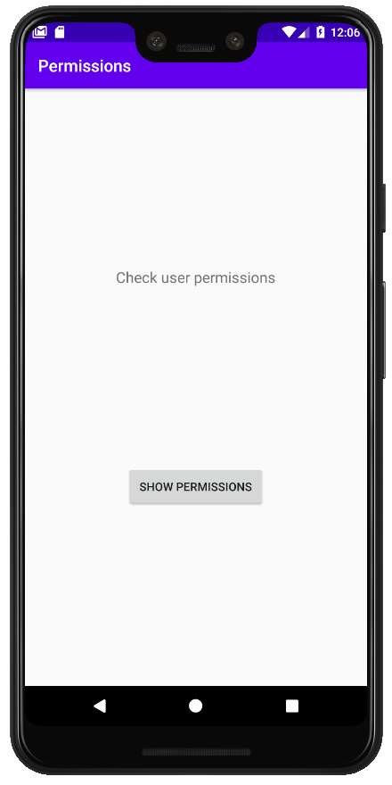
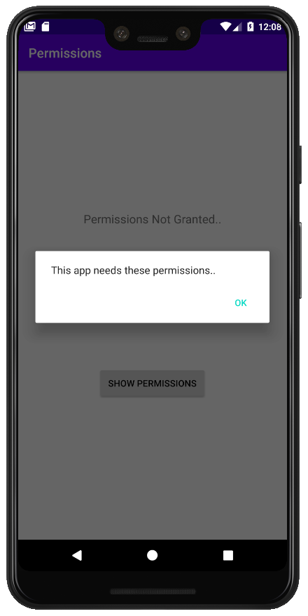
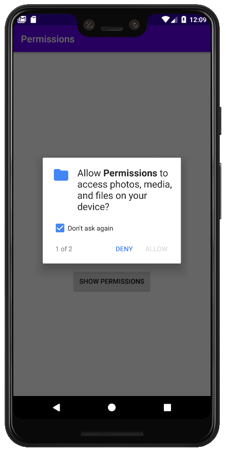
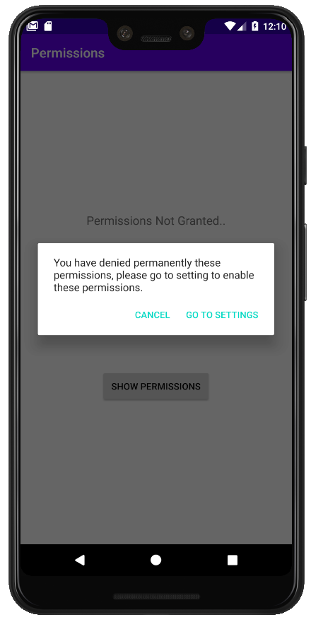
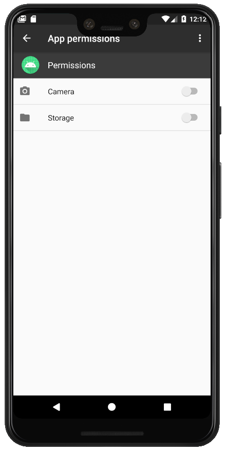
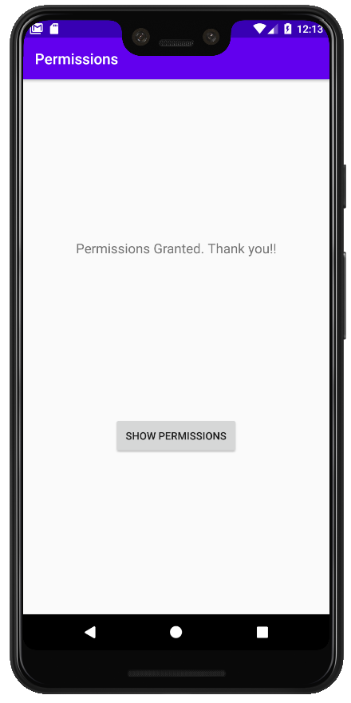

# Permissions-Kotlin
Permissions using kotlin, shouldShowRequestPermissionRationale, requestPermissions, App Settings

## Permissiosn in the Manifest File:

```
    <uses-permission android:name="android.permission.WRITE_EXTERNAL_STORAGE"/>
    <uses-permission android:name="android.permission.CAMERA"/>
```

## Minimum sdk version in Gradle (Module:app):

```
    minSdkVersion 23
```

## Defining a Permission code:

```
    // Could be any number
    private val PERMISSION_CODE = 1001
```

I use the following permission methods:

```
    * checkSelfPermission(permission : String): 
    Checking the permissions {Manifest.permission.CAMERA or Manifest.permission.WRITE_EXTERNAL_STORAGE}
    
    * shouldShowRequestPermissionRationale (permission : String): 
    Checking for permissions for first time.
    
    * requestPermissions(permissions : Array<String>, requestCode : Int): 
    List of permissions and code for being checking in permission result.
```

Finally, I check my PERMISSION_CODE in onRequestPermissionsResult:

```
     override fun onRequestPermissionsResult(requestCode: Int, permissions: Array<out String>, 
                                             grantResults: IntArray) {
        super.onRequestPermissionsResult(requestCode, permissions, grantResults)

        when (requestCode) {
            PERMISSION_CODE ->
            .....
```

<p align="center">
  
   

</p>
